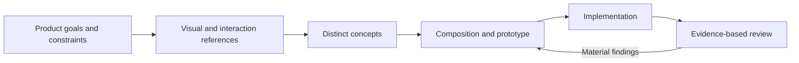

# Design Workbench

**A coordinated design and writing toolkit for AI agents.**

11 skills for turning product goals and visual references into distinctive interfaces, reviewing the result, and refining the words that support it. Built around the open [Agent Skills format](https://agentskills.io/specification), with one design lead and focused specialists.

[Quick start](#quick-start) · [Skills](#skills) · [Workflow](#workflow) · [Compatibility](#compatibility) · [Sources](docs/SOURCES.md)

## Why this collection

Design guidance often overlaps: one skill chooses a direction, another applies a different aesthetic, and a third rewrites the same copy. Design Workbench gives each skill a defined responsibility and a [shared routing policy](skills/design-lead/reference/skill-map.md).

- **Start with the product.** Establish the task, audience, content, and constraints before choosing a visual direction.
- **Research before styling.** Study actual references and explore alternatives that differ in composition and interaction.
- **Preserve creative intent.** Judge decisions against the brief and rendered evidence, rather than treating familiar fonts or patterns as automatic defects.
- **Keep reviews focused.** Use the relevant specialist, preserve useful behavior, and stop when the requested work is complete.
- **Work across agents.** Core instructions use Markdown and relative resource paths. Host-specific tools and adapters are optional.

## Quick start

Clone the repository:

```sh
git clone https://github.com/hadan8977/design-workbench-skills.git
cd design-workbench-skills
```

Use the [Skills CLI](https://github.com/vercel-labs/skills) to inspect the collection, then select your agent and installation scope:

```sh
npx skills add . --list
npx skills add . --skill '*'
```

Install the whole collection to preserve its sibling references. The CLI offers agent selection; for example:

```sh
npx skills add . --skill '*' --agent claude-code
npx skills add . --skill '*' --agent cursor
npx skills add . --skill '*' --agent codex
```

Add `--global` for a user-level installation, or `--copy` if symlinks are unsuitable. The CLI is an external installer and requires Node.js. It is not required to read or use the skill instructions.

**Manual installation:** copy all folders inside `skills/` into the skills directory documented by your agent. Keep their names and sibling layout, including references, scripts, data, assets, and license files. Compare any existing same-named folders before replacing them. Reload your agent's skill catalog as required by that host.

## Skills

Names follow `<domain>-<purpose>` in lowercase kebab case. Each folder and its `SKILL.md` frontmatter use the same name.

| Skill | Use it for |
| --- | --- |
| **Design** | |
| [design-lead](skills/design-lead/SKILL.md) | Product framing, visual research, concepts, composition, implementation, and overall critique |
| [design-reference](skills/design-reference/SKILL.md) | Focused searches for palettes, typography, charts, UX guidance, and stack patterns |
| [design-review](skills/design-review/SKILL.md) | Diagnosing generic UI choices against the actual brief and rendered result |
| [design-purpose](skills/design-purpose/SKILL.md) | Checking whether a repeated visual or copy choice serves a useful purpose |
| [design-simplify](skills/design-simplify/SKILL.md) | Removing clutter from dashboards, settings, forms, and other task interfaces |
| [design-interaction](skills/design-interaction/SKILL.md) | Compact React controls, action menus, and truthful async feedback |
| [design-material](skills/design-material/SKILL.md) | Glass, fluid color, and shader selection within an established direction |
| **Writing** | |
| [writing-edit](skills/writing-edit/SKILL.md) | Editing prose while preserving facts, uncertainty, and the writer's voice |
| [writing-tighten](skills/writing-tighten/SKILL.md) | A quick cleanup of short copy with minimal changes |
| [writing-audit](skills/writing-audit/SKILL.md) | An explicitly requested detailed style audit or rewrite |
| **Quality** | |
| [quality-score](skills/quality-score/SKILL.md) | Requested evidence-backed grades, report cards, or humorous tickets |

Start broad design tasks with `design-lead`. A focused request can go directly to its specialist. Use one writing editor per passage; scoring is optional.

## Workflow



The [design workflow](skills/design-lead/reference/new-work.md) scales to the task. A local spacing correction does not require a new discovery process. Analysis stays read-only unless implementation is requested.

`design-reference` supplies candidates to the lead. Interaction and material specialists support the chosen concept. Reviews contribute to one findings list and preserve that concept while correcting concrete problems.

## Usage

Natural-language requests work without a platform-specific command prefix:

> Use design-lead to review this dashboard against its intended tasks. Analyze only.

> Use design-lead to research visual references, compare distinct directions, and implement the selected direction for this screen.

> Use design-reference to find chart patterns for comparing an experiment with its baseline.

> Use writing-edit to tighten this draft while preserving its factual claims and personal voice.

Agents with skill pickers or command shortcuts can invoke the same names through their native UI. For example, a host may expose `$design-lead` or `/design-lead`; those invocation syntaxes are not universal requirements.

## Compatibility

The portable core is a collection of `SKILL.md` instructions and relative resources. The Skills CLI documents installation support for Claude Code, Cursor, Codex, OpenCode, GitHub Copilot, and other agents. Installation support does not establish that every optional tool works identically in every host.

| Capability | Requirement |
| --- | --- |
| Design planning, critique, and writing | An agent that can read the skill and its referenced files |
| Local design search | Python 3 and the bundled `design-reference` data |
| Writing detectors | Node.js for the optional `writing-audit` scripts |
| Deterministic scoring | Python 3 for `quality-score/scripts/score_ticket.py` |
| Rendered UI review | Available browser, screenshot, or image-viewing tools |
| Raster asset generation | An image-generation capability supplied by the host |
| Live variants and detector engine | Optional upstream Impeccable tooling; see [runtime notes](skills/design-lead/reference/runtime.md) |

`agents/openai.yaml` and the bundled TOML agent profiles are optional OpenAI-specific adapters. Other hosts use the portable instructions and their own tool interfaces. No hooks, services, browser binaries, or API integrations are installed merely by copying these folders.

The `writing-audit` skill remains explicit-only in its instructions and OpenAI adapter. Other hosts may handle automatic discovery differently, so invoke it deliberately when that detailed workflow is wanted.

## Updating an earlier installation

This collection previously used the upstream-style names and the repository title **Codex Design Skills**. The [name and source map](docs/SOURCES.md#skill-lineage) lists each old name and its replacement.

Update references in your own prompts or automation, install the new folders, and remove an old installation only after confirming it has no personal edits. Installing the new names alongside the old names can expose duplicate skills. This repository does not silently migrate or overwrite user-level installations.

Optional helper executables, engine state directories, asset filenames, and upstream URLs retain their original names for compatibility. For example, `design-lead` is the skill name; `scripts/impeccable` remains the upstream engine launcher.

## Contributing

Use English for maintained instructions, documentation, display names, and examples. The work produced by a skill follows the user's requested language; preserve quotations, identifiers, and multilingual test fixtures.

Keep `<domain>-<purpose>` names aligned across folder names, frontmatter, links, and optional display metadata. Put shared routing rules in the skill map. A new specialist should fill a distinct need rather than duplicate an existing lead or editor.

Validate edited entrypoints and local links. Exercise a helper when its behavior or resource paths change. Keep upstream notices and distinguish observed behavior from compatibility assumptions or proposed outcomes.

## Sources and licensing

This is a curated adaptation, with attribution preserved for its upstream work. It does not claim to be an official release of those projects. See [sources, name mapping, and licenses](docs/SOURCES.md) for the collection's lineage and the reference projects used to shape its documentation.

Included material retains its applicable license. There is no blanket license that replaces upstream terms, and no claim that every host or workflow has been tested.
